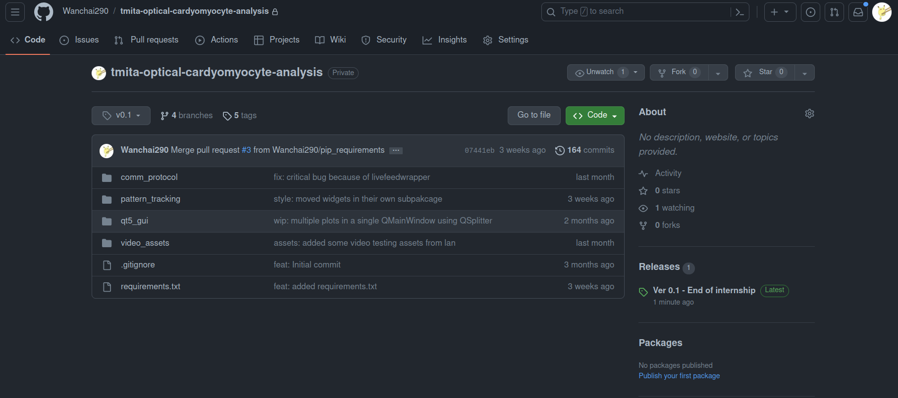
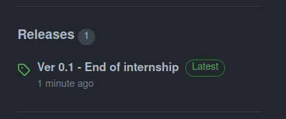
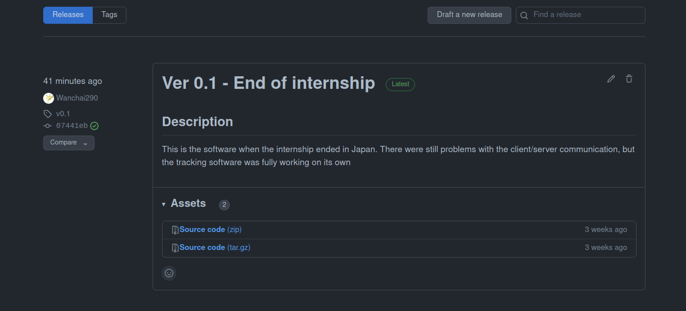
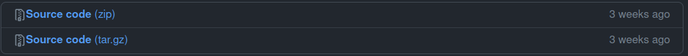

# Installing the tracking software

This file explains how to install the tracking software. If you were looking
for the custom Raspberry Pi installation at the Tixier-Mita Laboratory,
please click [here](custom_integrations/tixier_mita_lab/README.md)

---

## Pre-requisites

- Python 3 (version ≥ 3.10)
- pip (Python package manager)
- git (optional, for downloading the project from GitHub)

---

## Steps

### 1. Download the source code

Head to the following link:  
https://github.com/Wanchai290/tmita-optical-cardyomyocyte-analysis

Click on the **Releases** section on the right-hand side.



Click to view available versions:



Download the **latest** release.



Choose the `.zip` file under **Source code**:



Once downloaded, extract the archive wherever you want.

---

### 2. (Recommended) Create and activate a virtual environment

A virtual environment helps keep your project dependencies isolated from the rest of your system.

In the project folder, open a terminal and run:

```bash
# Create the virtual environment (you can change .venv to any folder name)
python3 -m venv .venv
```

To activate it:

**On Unix/macOS:**

```bash
source .venv/bin/activate
```

**On Windows (cmd):**

```cmd
.venv\Scripts\activate
```

Once activated, your terminal should show `(.venv)` at the beginning of the prompt. This means you're inside the environment.

To **deactivate** the virtual environment at any time:

```bash
deactivate
```

To **reactivate it later**, navigate to the project folder again and run the same command depending on your OS.

---

### 3. Install dependencies

Make sure you're in the virtual environment before doing this step.

**On Unix/macOS:**

```bash
chmod u+x install_requirements.sh run.sh
./install_requirements.sh
```

**On Windows:**

Just double-click `install_requirements.bat`.

---

### 4. Run the program

**On Unix/macOS:**

```bash
./run.sh
```

**On Windows:**

Double-click `run.bat`.

---

## Notes

- The software was primarily tested on **Ubuntu 22.04** and **Windows 11**.
- No compatibility issues were reported, but Linux is preferred for development/debugging.
- If you encounter any problems with OpenCV or PySide6 installations, check your Python version and system architecture.
